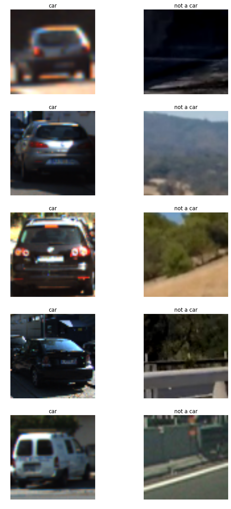
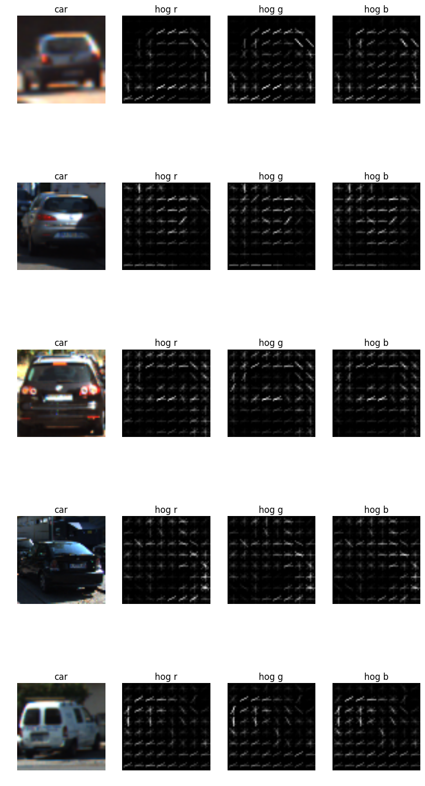
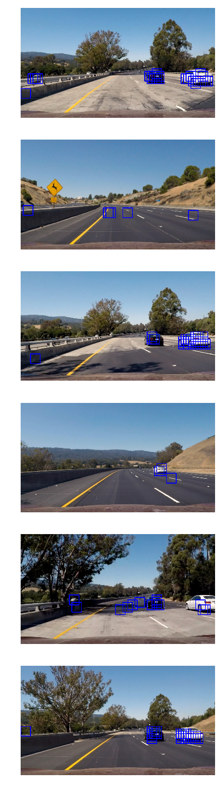
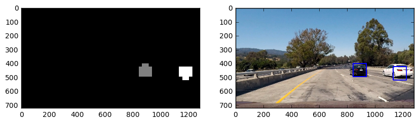

# Vehicle-Detection-P5
### Udacity - CarND-Vehicle-Detection

*Vehicle Detection Project*

The goals / steps of this project are the following:

* Perform a Histogram of Oriented Gradients (HOG) feature extraction on a labeled training set of images and train a classifier Linear SVM classifier
* Optionally, you can also apply a color transform and append binned color features, as well as histograms of color, to your HOG feature vector.
* Note: for those first two steps don't forget to normalize your features and randomize a selection for training and testing.
* Implement a sliding-window technique and use your trained classifier to search for vehicles in images.
* Run your pipeline on a video stream (start with the test_video.mp4 and later implement on full project_video.mp4) and create a heat map of recurring detections frame by frame to reject outliers and follow detected vehicles.
* Estimate a bounding box for vehicles detected.

### Training data
Training data for image patches containing cars and patches that don't contain cars are provided were obtained from [vehicles](https://s3.amazonaws.com/udacity-sdc/Vehicle_Tracking/vehicles.zip) and [non-vehicles](https://s3.amazonaws.com/udacity-sdc/Vehicle_Tracking/non-vehicles.zip).

Here's a random sample from them:


### Histogram of Oriented Gradients (HOG)
The HOG can be calculated using the 'hog' function from skimage:
```python
from skimage.feature import hog

features, hog_image = hog(img, orientations=orient, 
                                  pixels_per_cell=(pix_per_cell, pix_per_cell),
                                  cells_per_block=(cell_per_block, cell_per_block), 
                                  transform_sqrt=True, 
                                  visualise=vis, 
                                  feature_vector=feature_vec)
```

Using 8 for orientations, 8 for pixels_per_cell, and 2 for cells_per_block, we can inspect the features we get from hog:


### Training a classifier
In addition to the features extracted from hog, I have also added color histogram and spatial features:

*remember to use a scaler, especially when combining features extracted by various methods*

```python
X_scaler = StandardScaler().fit(X)
# Apply the scaler to X
scaled_X = X_scaler.transform(X)
```

*split the data set to train and test sets*
```python
X_train, X_test, y_train, y_test = train_test_split(
    scaled_X, y, test_size=0.2, random_state=rand_state)
```
*train the classifier (in our case: LinearSVC)*

```python
svc = LinearSVC()
svc.fit(X_train, y_train)
```

Here's the output from the training:

*Using: 8 orientations 8 pixels per cell and 2 cells per block*

*Feature vector length: 5568*

*19.97 Seconds to train SVC...*

*Test Accuracy of SVC =  0.9837*

### Sliding windows search
Using a sliding windows algorithm, we search our region of interest in the image for a match to a car, for a positive prediction by the classifier. We can control the size of the sliding windows and the amount of overlap between them.

Here's an example of results obtained with the sliding windows:


False positives are clearly visible in these examples, and we will deal with them in the video pipeline using a heatmap.

### Video pipeline and heatmap
For the video pipeline we are going to use a heatmap for a better detection of actual objects in the image and not noise. The heatmap also allows us to use the labels function to identify the objects from all the rectangles.

Here's a visualization of such an identification:


And for better tracking, the heatmap is calculated for the past 20 frames, and with a minimum threshold applied, this helps us remove the false positives, and provides a more stable detection and tracking algorithm.

And here's a link to the pipeline applied to 'project_video.mp4': [video](project_video_output.mp4)

### Discussion
This project represents a powerful pipeline for cars detection and tracking. The ideas here can be better improved and more perfected. However, this approach suffers from slow performance (took more than 10 minutes to create the video), and there are still many assumptions made (like light of day and slow moving cars). 
